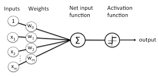
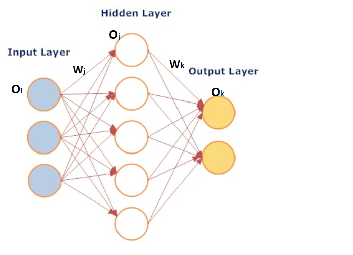

# Neural_Network_explaination
This is a simple network to Understand, You Can extand this Network and add more Layers in the network but the Idea behind the scene is always same.  

# What is Neural Network :
        A neural network is a series of algorithms that endeavors to recognize underlying relationships in a
        set of data through a process that mimics the way the human brain operates. 
        Neural networks can adapt to changing input; so the network generates the best possible result 
        without needing to redesign the output criteria.
        
   
  
# Feedforword :
  

Output of First Layer is the sumation of multiplied all the input and Weight.
   
  
  
  
   

# Error Calculation: 
        Calculating the Error at the Output_2
  

        Also write as :

 
        Calculating the error at Output_1 
 

        Also Write as:
        

# Back Propagation
        Update the Weights
   

  

        Update the Bias

        Hope you understand the Basic idea behind the Neural Network
        
# Thank You :-
